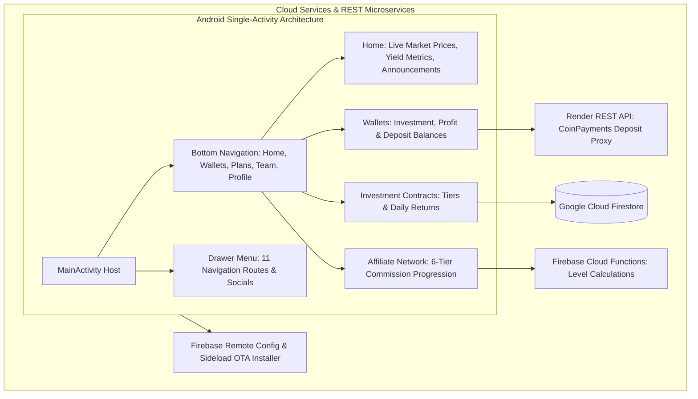

# BitBloom User — Android Cryptocurrency Investment & Financial Rewards Platform

[](https://kotlinlang.org)
[](https://developer.android.com)
[](https://gradle.org)
[](https://firebase.google.com)
[](LICENSE)

BitBloom User is a comprehensive native Android financial management and cryptocurrency cloud investment application built with modern Kotlin, Jetpack Navigation, custom OpenGL/Canvas gamification animations, and Firebase serverless cloud architecture.

---

## Application Architecture



---

## Key Features

- **Multi-Tier Investment Engine**: Dynamic calculation and real-time streaming of daily investment yields, contract durations, and direct sponsor bonuses.
- **6-Level Referral Network Hierarchy**: Dynamic team tracking calculating direct and indirect business volume across 6 downstream affiliate tiers.
- **Crypto Deposit & Withdrawal Gateway**: Integration with CoinPayments via dedicated Render backend proxy for automated USDT deposit invoice creation and withdrawal processing.
- **Gamification & Rewards Engine**: Daily login streaks, Lucky Spin wheel, milestone achievements, and recurring monthly salary progression.
- **In-App Customer Support & OTA Updater**: Direct support ticketing system and automated APK self-update flow with SHA-256 hash validation.

---

## Technical Stack

| Component | Library / Framework | Version |
|---|---|---|
| **Language** | Kotlin | 2.1.10 |
| **Build System** | Android Gradle Plugin / Gradle | 8.10.1 / 8.11.1 |
| **SDK Levels** | Compile SDK: 35, Target SDK: 35, Min SDK: 24 | Android 7.0+ |
| **Navigation & UI** | Jetpack Navigation Component + ViewBinding + DrawerLayout | 2.9.0 |
| **Cloud Services** | Firebase Auth, Firestore, Cloud Functions, Remote Config, Storage | Firebase BoM 33.15.0 |
| **Networking & HTTP** | OkHttp3 + Volley + Gson + Moshi | 4.12.0 / 2.12.1 |
| **Visual Effects & Animations** | Airbnb Lottie, LuckyWheel, Shimmer | 6.5.2 |

---

## Setup & Local Development

### Prerequisites
- Android Studio Ladybug (2024.2.1+) or newer
- JDK 17 / Java 11 runtime
- Android SDK 35 installed

### Step-by-Step Configuration

1. **Clone the Repository:**
   ```bash
   git clone https://github.com/shayann07/bitBloom-user.git
   cd bitBloom-user
   ```

2. **Configure Firebase Credentials:**
   Copy the example configuration template:
   ```bash
   cp app/google-services.json.example app/google-services.json
   ```

3. **Configure Local SDK:**
   ```bash
   cp local.properties.example local.properties
   ```

4. **Build the Application:**
   ```bash
   ./gradlew assembleDebug
   ```

---

## Repository Structure

```
bitBloom-user/
├── app/
│   ├── src/main/
│   │   ├── java/com/codingEmpire/bitbloom/
│   │   │   ├── adapters/       # 22 Recycler & ViewPager adapters
│   │   │   ├── fcm/            # Push notification & FCM token services
│   │   │   ├── models/         # 35 Data models (User, Plan, Wallet, etc.)
│   │   │   ├── repos/          # 14 Repositories (Auth, BuyPlan, Wallet, Transaction)
│   │   │   ├── ui/             # MainActivity, 36 Fragments, 18 ViewModels
│   │   │   └── utils/          # Constants, RemoteUpdateManager, SoundManager
│   │   ├── res/                # ~110 layouts, animations, navigation graph
│   │   └── AndroidManifest.xml # Deep links, FileProvider, permissions
│   ├── google-services.json.example
│   └── build.gradle.kts
├── local.properties.example
├── LICENSE                     # MIT License
└── README.md
```

---

## License

Distributed under the MIT License. See [LICENSE](LICENSE) for more information.

Copyright (c) 2026 **shayann07**
