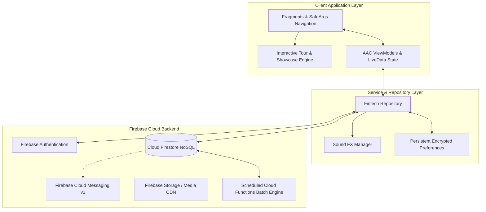
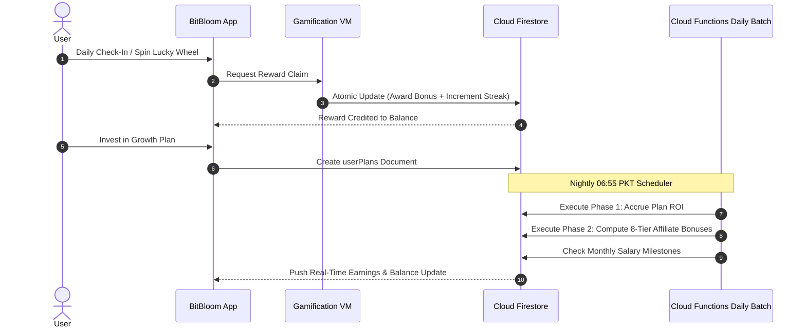

# BitBloom (User Client)

[](https://developer.android.com)
[](https://kotlinlang.org/)
[](https://developer.android.com)
[](https://developer.android.com/topic/architecture)
[](https://firebase.google.com/docs/firestore)
[](LICENSE)

> Feature-packed Android crypto-fintech application blending digital asset investments, an 8-level MLM affiliate network, gamified rewards (Lucky Wheel & Daily Streaks), leadership salaries, and automated USDT wallet settlement.

---

## 📖 Overview

**BitBloom User** is an Android fintech and wealth-generation platform designed to democratize high-yield digital asset investments and affiliate network building. Built with **Kotlin**, **MVVM**, **Jetpack Navigation (SafeArgs)**, and **Google Firebase**, BitBloom provides a gamified investor journey featuring daily ROI accruals, automated monthly salary milestones, interactive Lucky Spin rewards, and a multi-level affiliate commission engine.

### Core Highlights
- **Dynamic Investment Plans**: Real-time streaming of fixed-term investment contracts with automated daily ROI credits and principal renewal.
- **8-Tier Downline Affiliate Engine**: Track direct and indirect referrals across up to 8 downstream levels with active unlocking criteria.
- **Gamified Investor Retention**: Engage users through daily check-in rewards, milestone achievements, interactive sound effects, and the animated Lucky Spin Wheel.
- **Leadership Career & Salary System**: Automated monthly stipends awarded to network leaders reaching specific active member and capital milestones.
- **Crypto Payment Rails**: Instant deposit address creation and withdrawal request verification via USDT-BEP20 / TRC20 and CoinPayments gateway integrations.

---

## 🏗️ Architecture & Interaction Flow



### Investor Gamification & Earning Flow



---

## ✨ Core Features

### 1. 📈 Investment Portfolios & Plan Receipts
- **Tiered Investment Catalog**: Browse customized packages with flexible lock-in periods, daily ROI yields, and minimum entry thresholds.
- **Digital Plan Receipts**: Generate verifiable in-app purchase receipts with transaction IDs, timestamps, and return schedules.

### 2. 🎡 Gamification & Loyalty Engine
- **Lucky Spin Wheel**: Physics-based animated prize wheel granting daily bonus rewards and investment vouchers.
- **Daily Check-In Streaks**: Consecutive daily login incentives boosting retention and investor engagement.
- **Milestone Achievements**: Unlock tiered badges and cash bonuses for completing deposit, referral, and investment goals.

### 3. 👥 8-Level MLM Affiliate Network
- **Hierarchical Downline Explorer**: Deep-tree viewer breaking down active members, deposit volume, and earned commissions per level.
- **Dynamic Tier Unlocking**: Level 2 through Level 8 commission tiers unlock progressively based on direct active recruit thresholds.
- **Global Leaderboards**: Competitive investor leaderboards showcasing top affiliates and high-yield portfolios.

### 4. 💼 Leadership Career & Monthly Salaries
- **Network Career Progression**: Formal qualification tiers based on total downline volume and team size.
- **Recurring Monthly Salary**: Automated monthly stipend disbursement directly into the leader's main wallet.

### 5. 💬 Customer Help Desk & Interactive Onboarding
- **Multi-Media Support Tickets**: In-app ticketing system supporting camera captures, image cropping (`uCrop`), and status updates.
- **Interactive App Tour**: Guided visual walkthroughs powered by `TapTargetView` and `MaterialShowcaseView` for new user onboarding.

---

## 📱 Key Screens & Navigation Map

| Module | Fragment / Activity | Key Features |
|---|---|---|
| **Onboarding & Auth** | `LoginFragment`, `SignupFragment`, `ForgetPasswordFragment` | Firebase phone/email authentication, referral attribution, password recovery. |
| **Home Dashboard** | `HomeFragment`, `DashboardFragment` | Portfolio value summary, today's ROI, quick deposit/withdraw buttons, promotional banners. |
| **Gamification** | `LuckySpinFragment`, `DailyRewardFragment`, `AchievementsFragment` | Animated Lucky Wheel, streak counters, milestone achievement cards. |
| **Investments** | `InvestmentPlansFragment`, `PlansFragment`, `PlanRecieptFragment` | Plan selection, purchase confirmations, and active contract monitoring. |
| **Team & Downlines** | `TeamLevelsFragment`, `LevelUsersFragment`, `LeaderboardFragment` | 8-level tree breakdown, level user lists, affiliate turnover leaderboards. |
| **Wallet & History** | `WalletFragment`, `DepositFragment`, `WithdrawFragment`, `TransactionsFragment` | Crypto top-ups, withdrawal requests, transaction filters, and profit histories. |
| **Support & Account** | `SupportFragment`, `TicketDetailsFragment`, `ProfileFragment` | Live ticket desk, profile security, app language, and settings. |

---

## 🛠️ Technology Stack

| Layer | Technologies / Libraries |
|---|---|
| **Language & Tooling** | Kotlin 2.0, JDK 17/21, Gradle Version Catalogs (`libs.versions.toml`), SafeArgs |
| **UI Framework** | Android Jetpack (ViewBinding, SafeArgs Navigation, ConstraintLayout, Material 3) |
| **Architecture** | MVVM, Repository Pattern, Observable LiveData / Flow |
| **Gamification & UI** | `LuckyWheel-Android`, `TapTargetView`, `MaterialShowcaseView`, `uCrop`, `PhotoView`, `Lottie` |
| **Backend & Cloud** | Google Firebase (Authentication, Firestore NoSQL, Cloud Functions v2, Cloud Storage, FCM v1, AppCheck) |
| **Networking & Parsing**| OkHttp3, Moshi / Gson, Volley, gRPC OkHttp |
| **Audio & UX** | SoundPool (`SoundManager`) for tactile feedback and win effects |

---

## 🚀 Getting Started

### Prerequisites
- **Android Studio Ladybug (2024.2.1+)** or higher.
- **JDK 17** set as the Gradle JVM.
- **Android SDK 35** with Google Play Services.
- Configured Firebase project with Firestore and Authentication.

### Setup & Execution

1. **Clone the Repository**:
   ```bash
   git clone https://github.com/shayann07/bitBloom-user.git
   cd bitBloom-user
   ```

2. **Configure SDK Path**:
   ```bash
   cp local.properties.example local.properties
   ```
   Add your Android SDK location in `local.properties`.

3. **Firebase Setup**:
   Add your `google-services.json` to the `app/` directory:
   ```text
   app/google-services.json
   ```

4. **Build & Run**:
   ```bash
   # Assemble Debug Build
   ./gradlew assembleDebug

   # Execute Unit Tests
   ./gradlew testDebugUnitTest
   ```

---

## 📄 License

This project is open-source software licensed under the [MIT License](LICENSE) — Copyright (c) 2026 [shayann07](https://github.com/shayann07).
